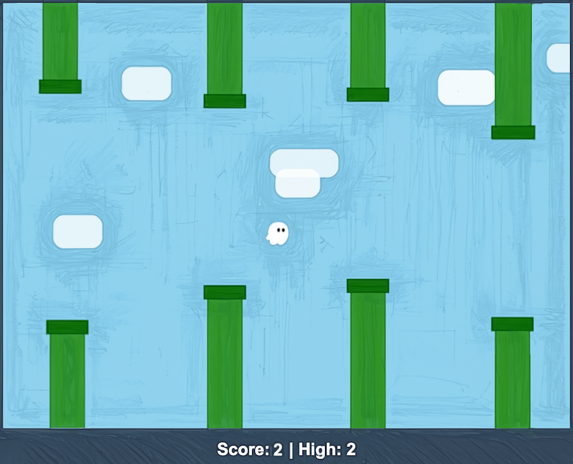

# Flappy Kiro

An arcade game in the style of Flappy Bird. Guide **Ghosty** through the gaps between pairs of walls. Every pair you pass scores a point. Touching a wall or the ground ends the game.



## Play

No build and no install. Open `index.html` in a browser, either by double-clicking it or from any static web server.

| Action | Keyboard | Mouse / touch |
|---|---|---|
| Flap (and start / restart) | Space | Click / tap the game |
| Pause / resume | P or Esc | ❚❚ button |
| Mute / unmute | M | 🔊 button |
| Settings (from start or pause) | S | Settings button |
| Back to start (on game over) | Esc | |

The Settings menu has Sound on/off, Motion Full/Reduced (it starts from your system's reduced-motion setting) and Reset high score (asks you to confirm first). The high score and settings are saved in the browser's localStorage.

## Develop

- Plain JavaScript, HTML5 Canvas and a few DOM overlays. No framework and no bundler.
- Scripts are classic `<script>` tags (not ES modules), so the game also works from `file://`.
- Game logic (`src/config.js` … `src/game.js`) has no DOM code. Each file registers on `window.FlappyKiro` in the browser and exports through `module.exports` in Node, where the tests run.
- Tuning values (gravity, speeds, gaps, difficulty) are in `src/config.js`.

```
index.html  styles.css
src/        config strings rng physics difficulty walls collision scoring storage game   (logic)
            audio renderer input main                                                    (browser)
tests/unit  example-based tests (node:test)
tests/pbt   property-based tests (fast-check)
tests/e2e   Playwright tests (loads index.html via file://)
```

## Test

npm is only used for the test tools:

```bash
npm install
npx playwright install chromium   # once
npm test                          # unit + property-based + E2E
npm run test:unit                 # unit + property-based only
ALL_BROWSERS=1 npm run test:e2e   # E2E on Chromium, Firefox and WebKit (npx playwright install firefox webkit first)
npm run audit                     # dependency vulnerability scan
```

Property-based tests print their seed. To replay a failure, run `FC_SEED=<seed> npm run test:unit`.

## Resources

- `assets/`: Ghosty's sprite, `jump.wav`, `game_over.wav`
- `img/`: the reference UI screenshot
- `aidlc-docs/`: requirements, design and the decision log (AI-DLC workflow)
